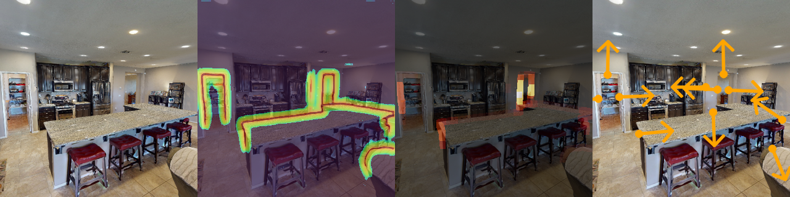
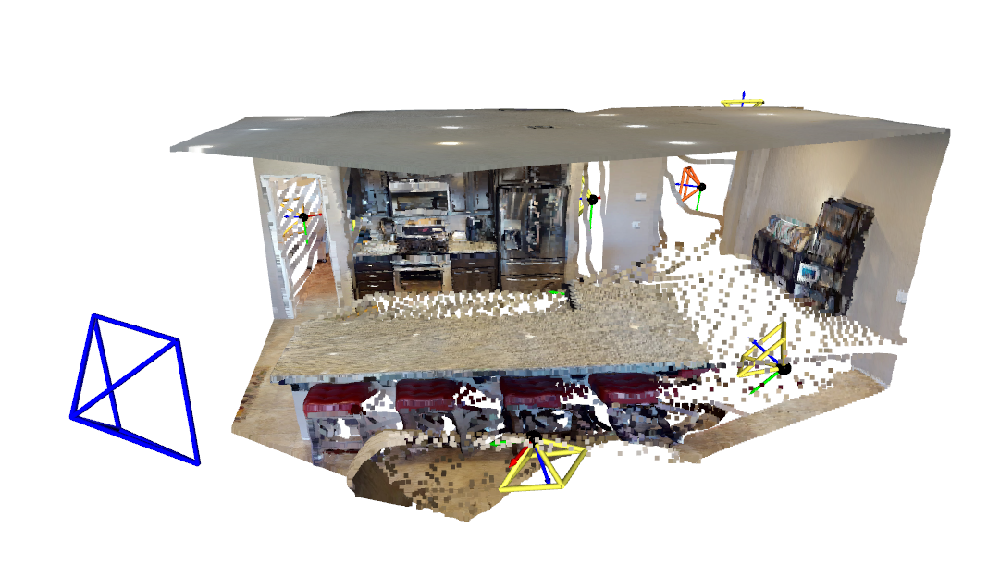

<p align="center">
  <h1 align="center"><ins>FrontierNet:</ins><br>Learning Visual Cues to Explore</h1>
  <p align="center">
    <a href="https://boysun045.github.io/boysun-website/">Boyang&nbsp;Sun</a>
    ·
    <a href="https://hanzhic.github.io/">Hanzhi&nbsp;Chen</a>
    ·
    <a href="https://scholar.google.ch/citations?user=SmGQ48gAAAAJ">Stefan&nbsp;Leutenegger</a>
    ·
    <a href="https://n.ethz.ch/~cesarc/">Cesar&nbsp;Cadena</a>
    ·
    <a href="https://www.microsoft.com/en-us/research/people/mapoll/">Marc&nbsp;Pollefeys</a>
    ·
    <a href="https://hermannblum.net/">Hermann&nbsp;Blum</a>
  </p>
  <h2 align="center">
  <strong>RA-L 2025</strong> <br>
  <a href="https://arxiv.org/pdf/2501.04597">ArXiv</a> |
  <a href="https://ieeexplore.ieee.org/stamp/stamp.jsp?arnumber=10999073">IEEE</a> |
  <a href=""> Video</a> |
  <a href=""> Webpage</a>
  </h2>
  

<p align="center" style="font-size: 1.0em;">
  <a href="">
    
  </a>
  <br>
  <em>
    FrontierNet learns to detect frontiers (the known–unknown boundary) and predict their information gains from visual appearance, enabling highly efficient autonomous exploration of unknown environments.
  </em>
</p>


## Quick Start
- 🔧 [Setup](#setup) — Install dependencies and prepare the environment.
- 🚀 [Run the Demo](#execution) — Try FrontierNet on example data(single image demo for now).
- 🛠️ [Pipeline Configurations](#pipeline-configurations) — Customize your pipeline.

## Setup


First clone the repository, install the dependencies and download model weights.

```bash
git clone --recursive  https://github.com/cvg/FrontierNet && cd FrontierNet
```
```bash
conda create -n frontiernet python=3.11 -y && conda activate frontiernet
```
```bash
pip install -r requirements.txt
```
```bash
bash download_weights.sh
```
Alternatively, download the [checkpoint](https://drive.google.com/file/d/11SugqEg3LR2voKdLvq9Xe_zch10ek006/view?usp=drive_link) manually.

<details>
<summary><b>[Optional - click to expand]</b></summary>

- Build and use [UniK3D](https://github.com/lpiccinelli-eth/UniK3D) as depth priors (dependency should be already installed)
```bash
cd third_party/UniK3D/ && pip install -e .
```

</details>


## Execution
### Single Image Inferrence 


Image from [HM3D](https://aihabitat.org/datasets/hm3d/):
```bash
python demo_single_image.py --input_img examples/hm3d_1.jpg --out_dir output/ --config config/hm3d.yaml
```
Image from [ScanNet++](https://kaldir.vc.in.tum.de/scannetpp/):
```bash
python demo_single_image.py --input_img examples/scannetpp_1.jpg --out_dir output/ --config config/scannetpp.yaml
```
Random Image (unknown camera):
```bash
python demo_single_image.py --input_img examples/internet_1.jpg --out_dir output/ --config config/any.yaml
```

By default, the pipeline uses Metric3Dv2 for depth. You can switch to UniK3D using:
```bash 
... --depth_source UniK3D
```

### Visualization

Visualize the output using:
```bash
python demo_plot.py --result_path output/<file_name>.npz
```
This first plots 2D result:

<p align="center">
    <a href=""></a> 
    <br>
</p>

Then press any key to see 3D frontiers in the RGBD pointcloud:
<p align="center">
    <a href=""></a> 
    <br>
</p>

### Full-Scene Exploration
Instruction and demo for scene exploration will be released soon. 

## Pipeline Configurations
Pipeline Configuration for whole scene exploration will be released soon. 

## ✅ TODO
- [ ] Add Planning pipeline by August. 
- [x] Add support of UniK3D
- [x] Add support of Metric3D

## ⚠️ Known Limitations
- Performance may degrade in outdoor scenes or highly cluttered indoor environments.
- Predictions are less reliable when objects are very close to the camera.

## 📖 Citation

If you use any ideas from the paper or code from this repo, please consider citing:

```bibtex
@article{boysun2025frontiernet,
  author={Sun, Boyang 
          and Chen, Hanzhi 
          and Leutenegger, Stefan 
          and Cadena, Cesar and 
          Pollefeys, Marc and 
          Blum, Hermann},
  journal={IEEE Robotics and Automation Letters}, 
  title={FrontierNet: Learning Visual Cues to Explore}, 
  year={2025},
  volume={10},
  number={7},
  pages={6576-6583},
  doi={10.1109/LRA.2025.3569122}
}
```
## 📬 Contact

For questions, feedback, or collaboration, feel free to reach out **Boyang Sun**:  
📧 boysun@ethz.ch  🌐 [boysun045.github.io](https://boysun045.github.io/boysun-website/)